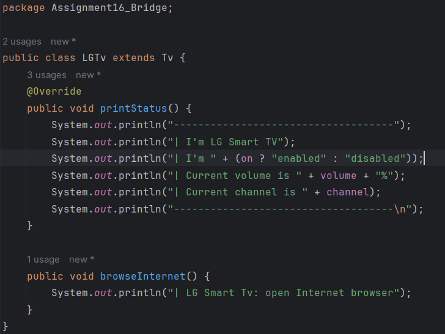
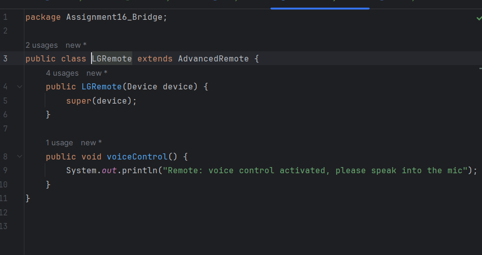
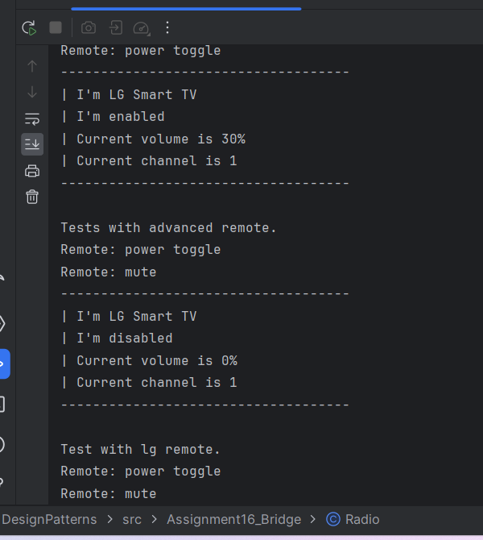

**Introduction**
The Bridge Pattern is a way of organizing code that helps keep different parts of a program separate. It's like building a bridge between two parts of a program so they can work together without being too dependent on each other. This pattern is useful because it lets us change one part of the program without having to change the other part.

For my project, I used a pattern I found on Refactoring Guru's website. It's all about devices and remotes. In this setup, we have two main things: remotes and devices. The Bridge Pattern helps us keep them separate but connected.

**Adding New Features**
I wanted to add something new to the project, so I created a new device called LGTV and a new remote called LGRemote. These additions show how we can easily add new stuff to the project without messing up what's already there. The LGTV can now browse the internet, and the LGRemote can understand voice commands.

**Testing**
To make sure everything works, I tried out the LGTV and LGRemote in my program. When I ran the program, everything worked as expected, showing that the new features are working fine.

**Conclusion**
In short, the Bridge Pattern is a handy way to organize code because it makes it easier to add new features without breaking what's already there. This makes it easier to manage and grow our program over time, adapting to changes as needed.